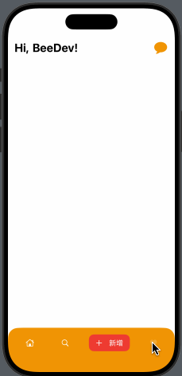
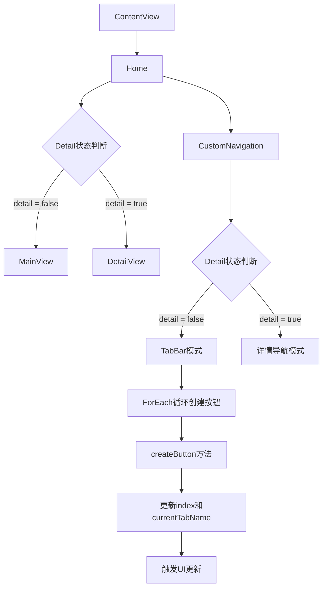

自定义标签栏 | 页面导航 | 动态切换 | 气泡效果 | 页面切换 | 详情展示 | 返回功能 | 动画过渡 | 状态切换 | 按钮反馈

View | Button | Image | Text | VStack | HStack | Spacer | GeometryReader | ForEach

@State | @Binding | 状态提升 | 数据绑定 | 状态传递

foregroundColor | background | cornerRadius | padding | frame | font | clipShape | resizable

animation | transition | 状态动画 | default

垂直布局 | 水平布局 | 弹性空间 | 安全区域 | 条件渲染 | 动态视图

systemName | 系统字体 | 系统颜色 | safeAreaInsets | edgesIgnoringSafeArea

组件化 | 模块化 | 代码复用 | 视图组织 | 数据流 | 属性包装器


# 介绍

这段代码展示了如何使用 SwiftUI 构建一个现代化的 iOS 应用界面，特别是在自定义导航栏和标签栏的实现上，展现了 SwiftUI 的强大功能和灵活性。
2. 视图状态管理 ：
- 使用 @State 和 @Binding 实现数据流
- 状态驱动的UI更新
3. 组件化设计 ：
- 独立的视图组件
- 清晰的职责划分
- 可复用的结构
### 核心重点
1. 自定义标签栏的实现 ：
- 动态切换效果
- 状态管理
- 自适应布局
### 创新点
1. 标签栏动画效果 ：
- 选中状态显示文本
- 背景色渐变
- 平滑过渡
2. 自适应布局 ：
- 安全区域适配
- 动态间距调整
- 响应式设计


### 架构说明：

1. 视图层级 ：
   
   - ContentView 作为入口
   - Home 作为容器视图
   - MainView 和 DetailView 作为主要内容视图
   - CustomNavigation 作为自定义导航栏
2. 状态管理 ：
   
   - @State 属性在 Home 中管理全局状态
   - @Binding 属性在子视图中接收状态
3. UI组件 ：
   
   - TabBar 按钮组件
   - 导航栏组件
   - 其他 UI 元素
图例说明：

- 粉色节点：状态管理
- 蓝色节点：视图组件
- 绿色节点：UI 组件
- 箭头：表示依赖关系或数据流向
```mermaid
graph TB
    subgraph "视图层级"
        A[ContentView]
        B[Home Container]
        C[MainView]
        D[DetailView]
        E[CustomNavigation]
    end

    subgraph "状态管理"
        F((@State index))
        G((@State detail))
        H((@State currentTabName))
        I((@Binding detail))
        J((@Binding currentTabName))
    end

    subgraph "UI组件"
        K[TabBar按钮]
        L[返回按钮]
        M[头像]
        N[标题]
        O[更多按钮]
    end

    A --> B
    B --> C
    B --> D
    B --> E
    
    F --> B
    G --> B
    H --> B
    
    I --> C
    J --> C
    
    E --> K
    E --> L
    E --> M
    E --> N
    E --> O

    classDef stateClass fill:#f9f,stroke:#333,stroke-width:2px
    classDef viewClass fill:#bbf,stroke:#333,stroke-width:2px
    classDef componentClass fill:#bfb,stroke:#333,stroke-width:2px

    class F,G,H,I,J stateClass
    class A,B,C,D,E viewClass
    class K,L,M,N,O componentClass
```

### 关键流程说明：

1. 视图层级 ：
   
   - ContentView 作为根视图
   - Home 作为容器视图
   - MainView 和 DetailView 作为主要内容视图
   - CustomNavigation 作为底部导航栏
2. 状态流转 ：
   
   - detail 状态控制主界面切换
   - index 控制标签页选择
   - currentTabName 显示当前标签名
3. 交互流程 ：
   
   - 标签切换：点击底部标签 → 更新index → 更新currentTabName → UI更新
   - 详情切换：点击消息按钮 → 切换detail状态 → 视图切换 → 导航栏样式改变
4. 数据绑定 ：
   
   - @State 在 Home 中管理状态
   - @Binding 在子视图中接收状态
5. 条件渲染 ：
   
   - 根据 detail 状态显示不同内容
   - 根据 index 状态显示不同标签样式
这个流程展示了一个典型的 SwiftUI 应用状态管理和视图切换的实现方式。


# 功能 & Thinking
## 1. animation(.defulat) 的动画意图是什么
使用 animation(.default) 的主要目的是为了提升用户界面的交互性和美观性，使得视图的变化更加流畅和易于理解。
#### 意图和用途
1. 平滑过渡：当视图的状态发生变化（例如，属性的更新、视图的添加或删除）时，使用 animation(.default) 可以使这些变化看起来更加平滑和自然，而不是突然发生。
>
2. 增强用户体验：通过动画，用户可以更容易地理解界面元素的变化。例如，当按钮被点击时，相关视图的变化会通过动画来提示用户。
>
3. 默认动画效果：.default 是 SwiftUI 提供的一个预设动画，通常是一个简单的线性动画，持续时间和曲线都是系统默认的。它可以快速应用于视图，而无需手动定义动画的具体参数。

## 2.在逻辑分支中的视图渲染注意事项

> The compiler is unable to type-check this expression in reasonable time; try breaking up the expression into distinct sub-expressions 
> 这个错误通常是由于 Swift 编译器在处理复杂的视图层次结构时遇到性能问题。

``` swift 
// MARK: 最佳实践：对于复杂的视图层级，建议将其抽取为独立的子视图组件
HStack {
    if !self.detail {
        // 使用一个函数来创建按钮
        ForEach(0..<4) { i in
            self.createButton(index: i)
            if i < 3 { Spacer() } // 在按钮之间添加间隔
        }
    } else {
        // ... existing code for detail view ...
    }
}
```
在 SwiftUI 中，当处理包含条件分支的视图渲染时，需要注意以下几个重要点：
1. 视图一致性 ：
- 不同分支的视图层级结构应该保持相对一致
- 避免在不同分支中出现过大的视图结构差异，这可能会导致动画过渡不自然
2. 性能考虑 ：
- 条件分支中的视图会被 SwiftUI 持续监控状态变化
- **对于复杂的视图层级，建议将其抽取为独立的子视图组件**
3. 状态管理 ：
- 确保状态变量（如这里的 detail ）的变化能够正确触发视图更新
- 注意状态变量的作用域和生命周